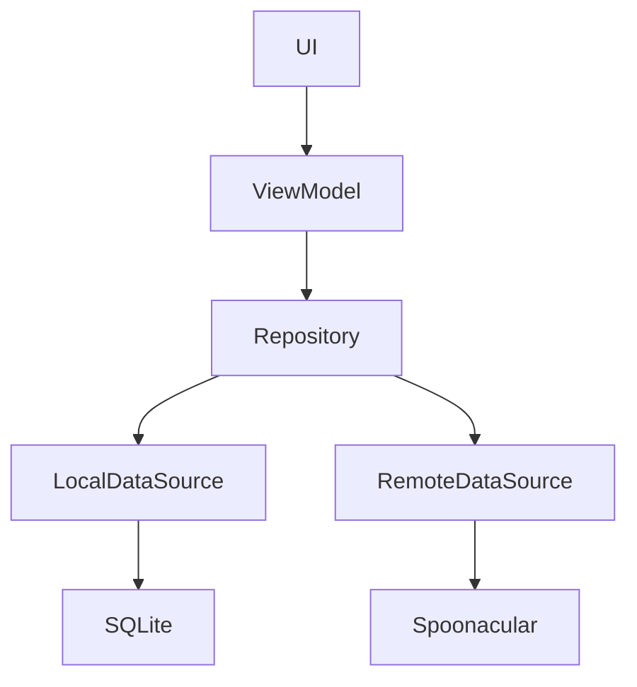

# Recipe

Recipe app that allows the user to search for recipes. Pressing a search result will navigate to a detailed view of the recipe which includes ingredients and cooking instruction steps.
Additionally you can mark a recipe as your favourite after which you can find it under `favourites`. Earlier visited details are cached locally for faster lookup.

## Getting started ✨

1. Clone project
2. Register and obtain API key from [Spoonacular](https://spoonacular.com/)
3. Locate the `secrets.defaults.properties` and make a copy of this file named `secrets.properties`
4. In your newly created `secrets.properties` replace YOUR_API_KEY with your API key (`API_KEY="<YOUR API KEY>"`) and save the file
5. Open the project in `Android Studio`
6. Build (and run) the project

# Screenshots

<table>
   <tr>
      <td></td>
      <td></td>
      <td></td>
      <td></td>
   </tr>
   <tr>
      <td></td>
      <td></td>
      <td></td>
      <td></td>
   </tr>
</table>

# Tech/Libraries 📚

* Kotlin (2.0.20)
  * Coroutines
  * Flow
* Jetpack
  * Jetpack Compose
  * ViewModel
  * Lifecycle
  * Persistence: [Room](https://developer.android.com/jetpack/androidx/releases/room)
  * Dependency Injection: [Hilt](https://developer.android.com/training/dependency-injection/hilt-android)
* Networking: [Ktor client](https://ktor.io/docs/welcome.html)
* Serialization: [Kotlinx Serialization](https://kotlinlang.org/docs/serialization.html)
* Image Loading: [Coil](https://coil-kt.github.io/coil/compose/)
* Other:
  * Error handling: [Arrow](https://arrow-kt.io/)
* Testing:
  * [Mockk](https://mockk.io/)
  * [Junit5](https://junit.org/junit5/)
  * [Turbine](https://github.com/cashapp/turbine)
  * [AssertK](https://github.com/willowtreeapps/assertk)

# Design/Architecture

This project is an attempt to follow Google's [recommended architecture](https://developer.android.com/topic/architecture). 

# Spoonacular

[Spoonacular](https://spoonacular.com/) provides the RESTful API which this app 'consumes'. They offer free plans, register to retrieve your API key.
